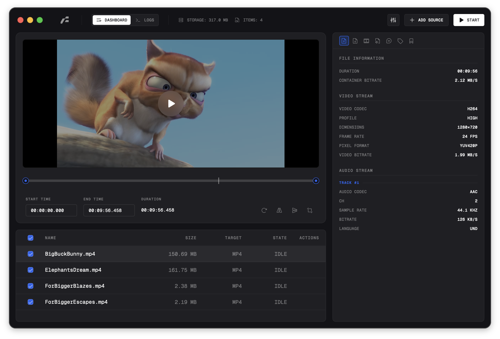

<div align="center">
  
  <h1>Frame</h1>
</div>

<div align="center">

[English](../README.md) | [简体中文](./zh-CN.md) | [日本語](./ja-JP.md) | [한국어](./ko-KR.md) | [Español](./es-ES.md) | [Русский](./ru-RU.md) | [Français](./fr-FR.md) | [Deutsch](./de-DE.md) | [Italiano](./it-IT.md)

</div>

<div align="center">
	
	
	
	
	
	
</div>

**Frame** は Tauri v2 フレームワーク上に構築された高性能メディア変換ユーティリティです。FFmpeg 操作のネイティブインターフェースを提供し、ビデオとオーディオのトランスコードパラメータを細かく制御できます。Rust ベースのバックエンドで並行タスク管理とプロセス実行を行い、Svelte 5 フロントエンドで設定と状態監視を行います。

<br />
<div align="center">
  
</div>
<br />

> [!WARNING]
> **未署名アプリケーションについて**
> アプリケーションは現在未署名のため、OS が警告を表示します：
>
> - **macOS：** システムがアプリとサイドカーバイナリに隔離属性を付与します。実行するには手動で属性を削除してください：
>   ```bash
>   xattr -dr com.apple.quarantine /Applications/Frame.app
>   ```
> - **Windows：** SmartScreen がアプリの起動を阻止する場合があります。**「詳細情報」** をクリックし、**「実行」** を選択してください。

## 機能

### メディア変換コア

- **コンテナサポート：** `mp4`, `mkv`, `webm`, `mov`, `mp3`, `m4a`, `wav`, `flac`.
- **ビデオエンコーダー：**
  - `libx264` (H.264 / AVC)
  - `libx265` (H.265 / HEVC)
  - `vp9` (Google VP9)
  - `prores` (Apple ProRes)
  - `libsvtav1` (SVT-AV1)
  - **ハードウェアアクセラレーション：** `h264_videotoolbox` (Apple Silicon)、`h264_nvenc` (NVIDIA)
- **オーディオエンコーダー：** `aac`、`ac3` (Dolby Digital)、`libopus`、`mp3`
- **ビットレート制御：** 固定品質 (CRF) または目標ビットレート (kbps)
- **スケーリング：** バイキュービック、ランチョス、バイリニア、ニアレスト
- **メタデータ解析：** `ffprobe` によるストリーム情報の自動抽出（コーデック、再生時間、ビットレート、チャンネルレイアウト）

### アーキテクチャとワークフロー

- **並行処理：** Rust 実装の非同期タスクキューマネージャー（`tokio::mpsc`）、同時 FFmpeg プロセス数を制限（デフォルト：2）
- **リアルタイムテレメトリ：** FFmpeg `stderr` のストリーム解析による正確な進捗追跡とログ出力
- **プリセット管理：** 再利用可能な変換プロファイルの設定永続化

## 技術スタック

### バックエンド (Rust / Tauri)

- **コア：** Tauri v2 (Rust Edition 2024)
- **ランタイム：** `tokio` (非同期 I/O)
- **シリアライゼーション：** `serde`、`serde_json`
- **プロセス管理：** `tauri-plugin-shell` (FFmpeg/FFprobe のサイドカー実行)
- **システム統合：** `tauri-plugin-dialog`、`tauri-plugin-fs`、`window-vibrancy`

### フロントエンド (SvelteKit)

- **フレームワーク：** Svelte 5 (Runes API)
- **ビルドシステム：** Vite
- **スタイリング：** Tailwind CSS v4、`clsx`、`tailwind-merge`
- **状態管理：** Svelte 5 `$state` / `$props`
- **国際化：** 多言語インターフェース、システム言語の自動検出
- **タイポグラフィ：** Geist Mono (埋め込み)

### インストール

#### Homebrew 経由 (macOS)

macOS で Frame をインストール・更新する最も簡単な方法は Homebrew Tap を使用することです：

```bash
brew tap 66HEX/frame
brew install --cask frame
```

### ビルド済みリリースを使用

Frame を実行する最も簡単な方法は [GitHub Releases](https://github.com/66HEX/frame/releases) ページからビルド済みパッケージをダウンロードすることです。各リリースには macOS (Intel/Apple Silicon)、Windows、Linux (AppImage/Deb) 用のビルドが含まれています。バイナリは未署名のため、OS が警告を表示し手動承認が必要な場合があります。

### 前提条件

- Node.js ランタイム（または Bun）
- Rust ツールチェーン (`cargo`)
- **FFmpeg** と **FFprobe** バイナリを `src-tauri/binaries/` ディレクトリに配置
  - 命名規則：`ffmpeg-<target-triple>`（例：`ffmpeg-aarch64-apple-darwin` または `ffmpeg-x86_64-pc-windows-msvc.exe`）

> ヒント：`bun run setup:ffmpeg`（または `npm run setup:ffmpeg`）を実行すると、OS/アーキテクチャに適したバイナリを自動ダウンロードできます。`--force` で既存のダウンロードを更新できます。

### ビルド手順

1.  **依存関係をインストール：**

    ```bash
    bun install
    ```

2.  **開発サーバーを起動：**

    ```bash
    bun run tauri dev
    ```

3.  **本番用にコンパイル：**
    ```bash
    bun run tauri build
    ```

## 使用方法

1.  **入力：** システムダイアログでファイルを選択
2.  **設定：**
    - **ソース：** 検出されたファイルメタデータを表示
    - **出力：** コンテナ形式と出力ファイル名を選択
    - **ビデオ：** コーデック、ビットレート/CRF、解像度、フレームレートを設定
    - **オーディオ：** コーデック、ビットレート、チャンネル、特定トラックを選択
    - **プリセット：** 再利用可能な変換プロファイルを保存・読み込み
3.  **実行：** Rust バックエンド経由で変換プロセスを開始
4.  **監視：** UI でリアルタイムログと進捗率を確認

## ライセンス

GPLv3 ライセンス。詳細は [LICENSE](../LICENSE) を参照。
